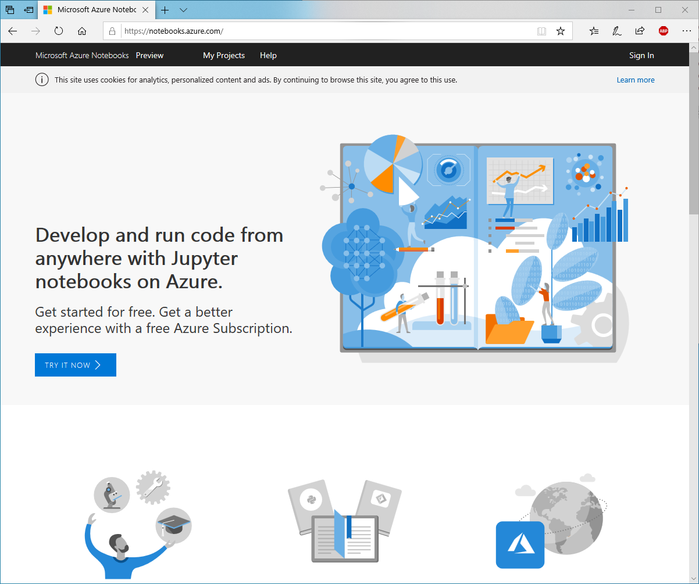
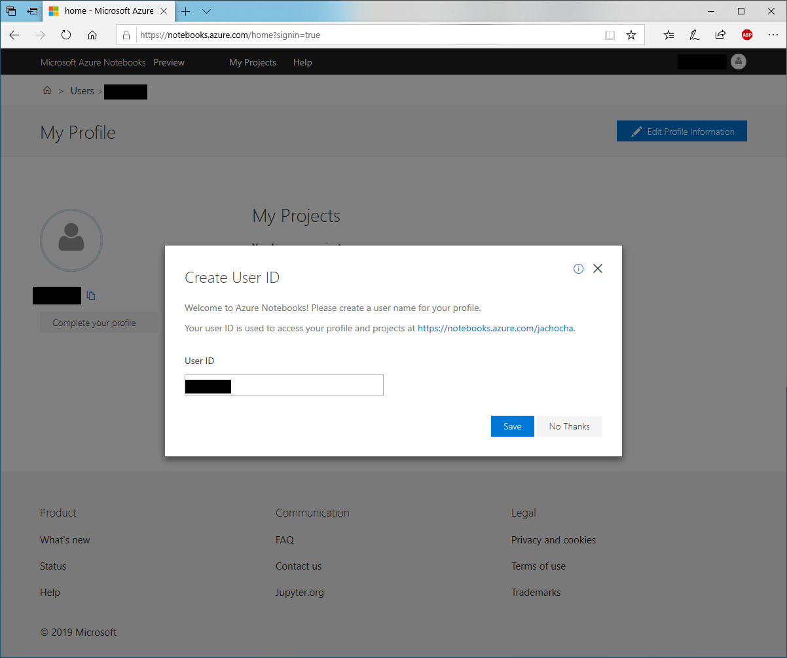
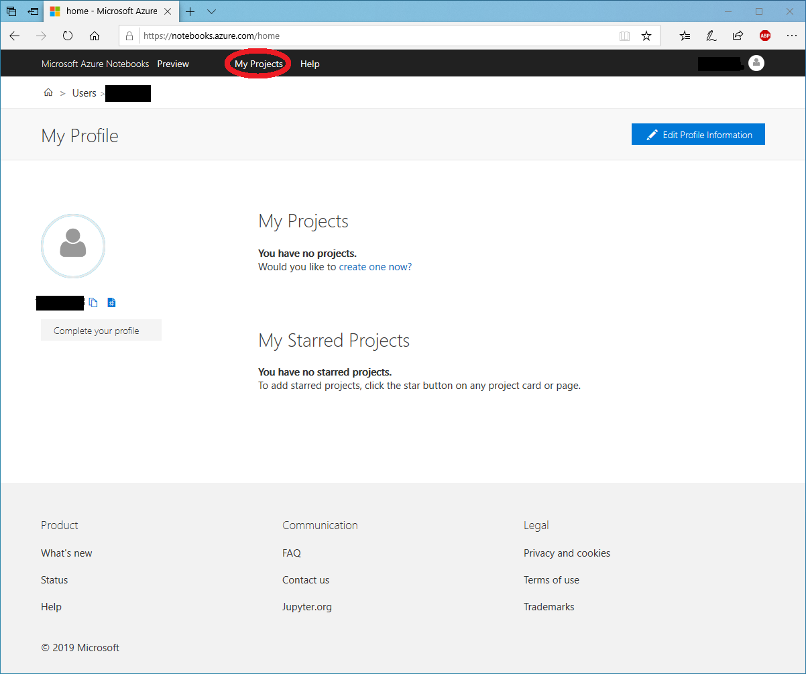
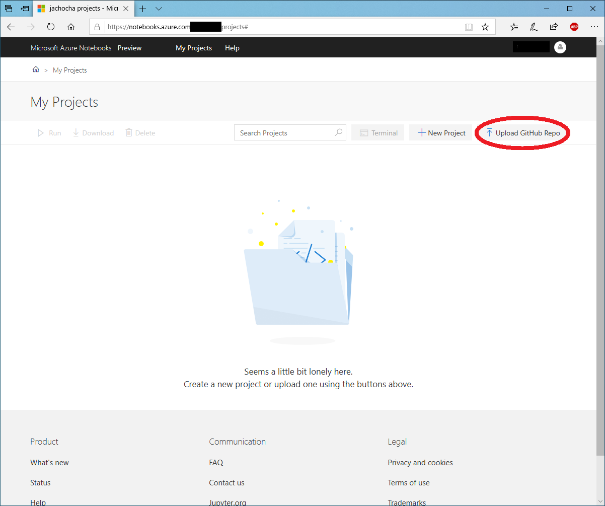
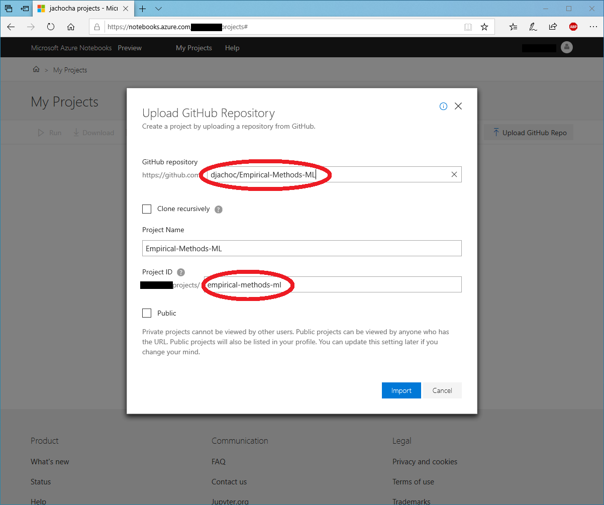

# Empirical-Methods-ML
Empirical Methods &amp; Machine Learning
___

**GitHub Repository**: [https://github.com/djachoc/Empirical-Methods-ML](https://github.com/djachoc/Empirical-Methods-ML)

#### Description
This repository corresponds to David Tomás Jacho-Chávez' Econ 485 Topics Course on '*Empirical Methods &amp; Machine Learning*' for the Spring 2020 semester at Emory University, Atlanta, GA, United States of America.

#### Disclaimer
All the materials in this repository are taken from these four sources and the original authors hold _all_ text, figures, and computer code copyrights:

1. Chapter 6 of the 5th edition of Jeffrey M. Wooldridge's '**[Introductory Econometrics: A Modern Approach](https://economics.ut.ac.ir/documents/3030266/14100645/Jeffrey_M._Wooldridge_Introductory_Econometrics_A_Modern_Approach__2012.pdf)**' textbook.
2. Chapter 11 of Bruce Hansen's '**[Econometrics](https://www.ssc.wisc.edu/~bhansen/econometrics/)**' online textbook.
3. Various chapters of '**[An Introduction to Statistical Learning: With Applications in R](http://faculty.marshall.usc.edu/gareth-james/ISL/)**' book by Gareth James, Daniela Witten, Trevor Hastie and Rob Tibshirani.
4. Various chapters of '**[Machine Learning Essentials: Practical Guide in R](http://www.sthda.com/english/articles/11-machine-learning/)**' book by Alboukadel Kassambara.

#### Set Up

***
<ins>Microsoft Azure Notebooks</ins>

1. Go to [https://notebooks.azure.com/](https://notebooks.azure.com/)

2. Sign in using your 'your_emory_email@emory.edu' or 'your_own_email@outlook.com' - If you don't have one create one beforehand. You must hit 'Yes' afterwards.

3. You will be asked to create an User ID. Select one and hit 'Save.'

4. You will be taken to your home directory. Select 'My Projects.'

5. Select 'Upload GitHub Repo'

6. Use "djachoc/Empirical-Methods-ML" as **GitHub repository** and "Empirical-Methods-ML" as **Project Name**. Then hit import and wait (it will take a minute or two).

7. You should now see this page, and you are ready to go.

***